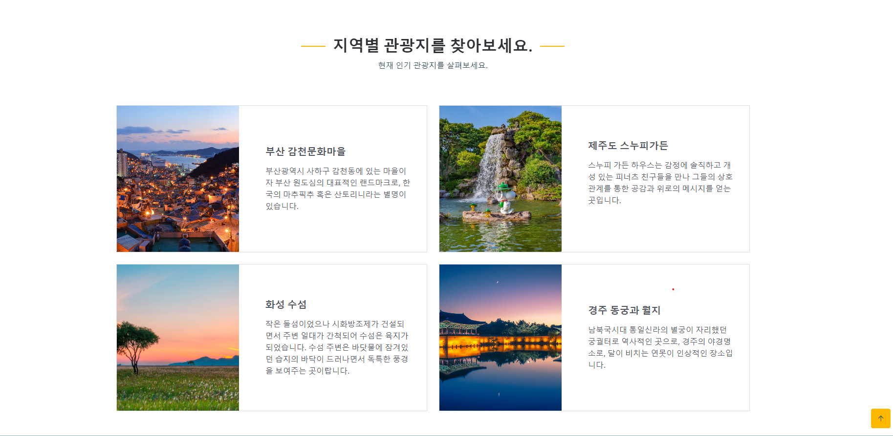

# README

# 세 번째 관통 프로젝트

# 팀원 소개

팀원

---

송은주

---

이강희

---

# 1. 기능 구현 목록

| 난이도 | 구현 기능 | 완성 여부 |
| --- | --- | --- |
| 필수 | 한국관광공사 : 지역별 관광지정보를 얻어와 화면에 표시 | ⭕ |
| 필수 | 관광지, 숙박, 음식점 조회 | ⭕ |
| 필수 | 문화시설, 공연, 여행코스, 쇼핑조회 | ⭕ |
| 필수 | 회원가입, 수정, 조회, 탈퇴 | ⭕ |
| 필수 | 로그인 / 로그아웃 / 비밀번호찾기 | ⭕ |
| 필수 | 지역 축제 정보 데이터 파일을 다운로드 받아 분석하여 화면에 출력 | ⭕ |

# 2. 기능 구현 시연

## 2.1. 메인 화면

## 2.2. 관광지 조회 화면

## 2.3. 문화시설, 공연 조회 화면

## 2.4. 회원가입 화면

## 2.5. 로그인/로그아웃 화면

## 2.6. 비밀번호 찾기 화면

## 2.7. 마이페이지 화면

